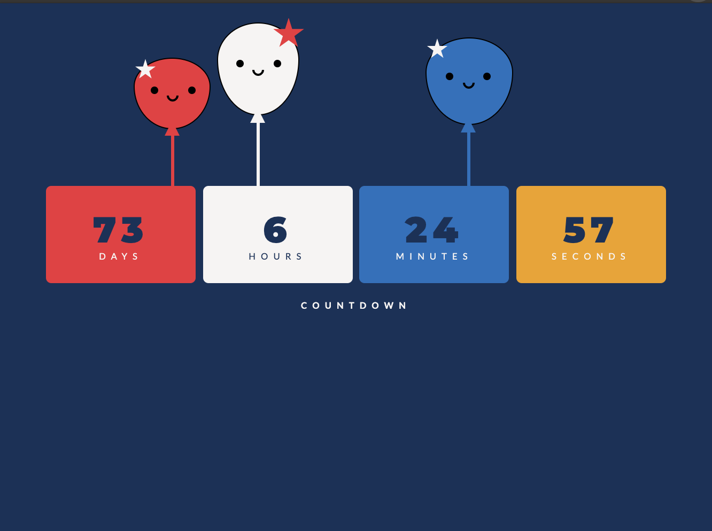

<!-- TABLE OF CONTENTS -->
## Table of Contents

* [About the Project](#about-the-project)
  * [Built With](#built-with)
* [Getting Started](#getting-started)
* [Manifest file](#manifest-file)

<!-- ABOUT THE PROJECT -->
## About The Project

This is a simple chrome extension that has both an example of a widget and a rule based on your url.  The widget is a simple countdown timer.  See files:

* popup.html
* popup.js
* popup.css
* image.png (for an example)

The url example is based on https://www.youtube.com/watch?v=rymG9UmPuhM and changes the style of any text with the word "coronavirus" to flash rainbows colours.  See files:

* script.js
* styles.css
* video.mov (for an example)

### Demo for changing text on a screen

### Demo for adding a countdown widget

### Built With

* [HTML](https://getbootstrap.com)
* [JS](https://jquery.com)
* [CSS](https://laravel.com)

<!-- GETTING STARTED -->
## Getting Started

Upload your chrome extension using developer mode. See:
https://support.google.com/chrome/a/answer/2714278?hl=en

Then test it out.

<!-- Manifest file -->
## Manifest file

Every chrome extension needs a manifest.json file.  
The "content_scripts" section is used for defining the scripts used to execute on each webpage. In here you can specify urls to include (in this example every url is included), urls to ignore (in this example we ignore the google search results as for some reason this was broken when not ignored).  We also design some styles (which are used when updating a word using those styles) and the JS file which will execute on the matching url.

The "browser_action" section is used for the widget and defines the html to render in the widget.  The icon can also be rendered this way.
